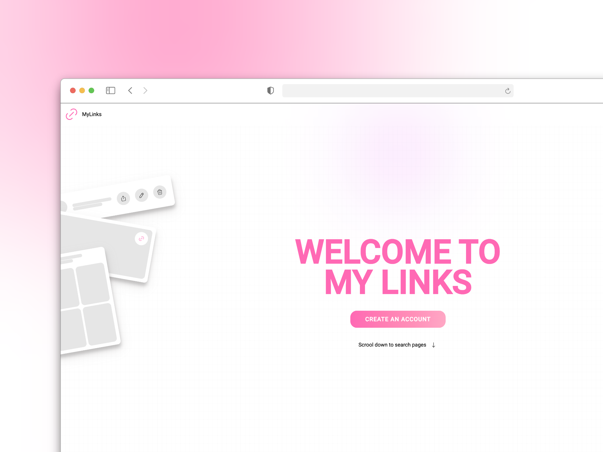

# Proyecto: MYLINKS - Frontend

Este proyecto es una aplicación web donde cada usuario puede crear y personalizar su propia página, añadiendo enlaces a sus redes sociales, sitios web personales o cualquier otro enlace que desee compartir. El frontend se encarga de la interfaz de usuario, proporcionando una experiencia atractiva y fácil de usar.


## Tecnologías utilizadas

- **Angular**: Framework principal para la creación de la interfaz de usuario.
- **Tailwind CSS**: Para el diseño y la estilización del frontend.
- **HTTPClient**: Para la comunicación con el backend.
- **Angular Router**: Manejo de rutas dentro de la aplicación.

## Estado del proyecto
Este proyecto está actualmente en desarrollo. Se están implementando nuevas características y corrigiendo errores.

## Notas
Existen aplicaciones similares ya en el mercado, como Linktree, que ofrecen funcionalidades parecidas. Este proyecto es un ejercicio educativo y no tiene fines comerciales.

## Cómo Colaborar

1. **Clona el Repositorio**

   Clona el repositorio del frontend usando los siguientes comandos:

   ```bash
   git clone https://github.com/tu-usuario/mylinks-frontend.git
   
2. **Instala las Dependencias**

    Navega a la carpeta del frontend e instala las dependencias necesarias con:
  
    ```bash
    cd mylinks
    npm install

3. **Configura el Backend**

  Asegúrate de seguir las instrucciones específicas del backend para su configuración, como la creación de variables de entorno o la configuración de la base de datos.
  ```bash
  https://github.com/pabloconejos/mylinks_back

